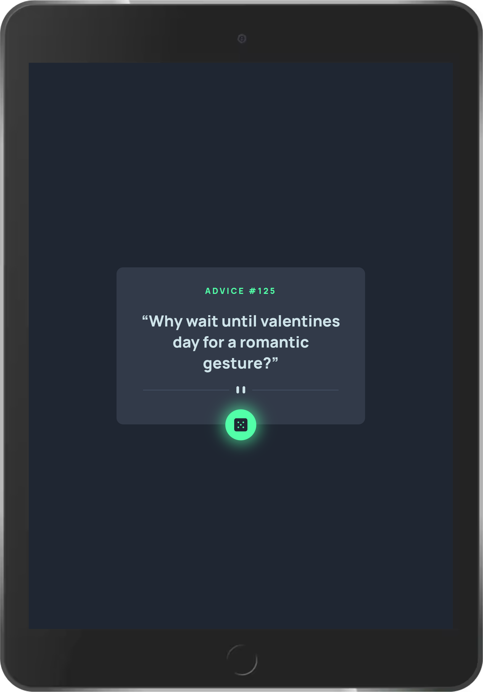
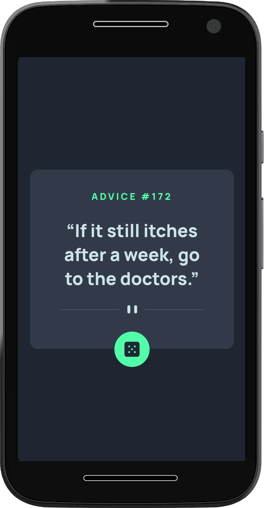

# Frontend Mentor - Advice generator app solution

This is a solution to the [Advice generator app challenge on Frontend Mentor](https://www.frontendmentor.io/challenges/advice-generator-app-QdUG-13db). Frontend Mentor challenges help you improve your coding skills by building realistic projects.

## Table of contents

-   [Overview](#overview)
    -   [The challenge](#the-challenge)
    -   [Screenshot](#screenshot)
    -   [Links](#links)
-   [My process](#my-process)
    -   [Built with](#built-with)
    -   [Useful resources](#useful-resources)
-   [Author](#author)
-   [Acknowledgments](#acknowledgments)

**Note: Delete this note and update the table of contents based on what sections you keep.**

## Overview

### The challenge

Users should be able to:

-   Get a random quote by clicking the dice button and a random quote on reload of the page

### Screenshot

 
 
 

### Links

-   Solution URL: [Github](https://github.com/mani-cmd/advice-generator-app)
-   Live Site URL: [Add live site URL here](https://your-live-site-url.com)

## My process

### Built with

-   HTML / CSS / Javascript
-   CSS custom properties
-   Flexbox
-   [adviceslip.com](Adviceslip.com) API

### Useful resources

-   [DevDocs](https://devdocs.io/) - This helped me with javascript asyn functions with async await.

## Author

-   Frontend Mentor - [@mani-cmd](https://www.frontendmentor.io/profile/mani-cmd)
-   Twitter - [@copyninja_03](https://www.twitter.com/copyninja_03)-
-   Instagram - [@copyninja_03](https://www.instagram.com/copyninja_03)

## Acknowledgments

This is a very basic project. Learning and understanding asynchronous functions in javascript will make this project easier.
